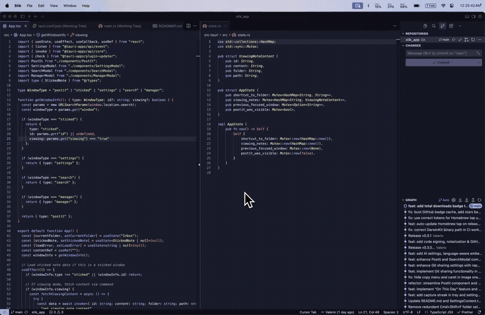

<p align="center">
  
</p>

<h1 align="center">Stik</h1>

<p align="center">
  <strong>Instant thought capture for macOS.</strong><br>
  Press a shortcut. Type your thought. Get back to work.<br>
  Under 3 seconds. Every time.
</p>

<p align="center">
  <a href="https://www.stik.ink">Website</a> &middot;
  <a href="https://www.youtube.com/watch?v=eiMUVcojTng">Demo</a> &middot;
  <a href="https://www.stik.ink/ideas">Ideas Board</a> &middot;
  <a href="https://x.com/stik_app">X</a> &middot;
  <a href="https://discord.gg/gG8vdCCRzW">Discord</a> &middot;
  <a href="https://github.com/0xMassi/stik_app/releases">Download</a> &middot;
  <a href="ROADMAP.md">Roadmap</a> &middot;
  <a href="CHANGELOG.md">Changelog</a>
</p>

<p align="center">
  <a href="https://github.com/0xMassi/stik_app/releases/latest"></a>
  
  
  <a href="https://github.com/0xMassi/stik_app/releases"></a>
  <a href="https://github.com/0xMassi/stik_app/stargazers"></a>
</p>

<p align="center">
  
</p>

---

## Why Stik?

Every note app wants to be your second brain. Stik just wants to catch your thought before it disappears.

No onboarding. No account. No sync setup. Hit `Cmd+Shift+S`, type, close. Your note is saved as a plain markdown file. That's it.

## Install

### Homebrew (Recommended)

```bash
brew install --cask 0xMassi/stik/stik
```

Or add the tap first:

```bash
brew tap 0xMassi/stik
brew install --cask stik
```

### Direct Download

Grab the latest `.dmg` from [GitHub Releases](https://github.com/0xMassi/stik_app/releases).

> Requires **macOS 10.15+**. On first launch, grant Accessibility permissions when prompted (needed for global shortcuts).

### Update

If you installed via Homebrew:

```bash
brew upgrade --cask stik
```

From v0.3.3 onwards, Stik includes a built-in auto-updater that silently downloads new versions in the background. Updates apply on next app restart.

## Features

**Capture** -- Global shortcuts summon a floating post-it from anywhere. Type, close, done. Notes are saved as markdown in `~/Documents/Stik/`.

**Organize** -- Folders (Inbox, Work, Ideas, or your own). Move notes with a keystroke. Search everything instantly.

**Pin** -- Keep important notes floating on your desktop as sticky notes.

**Rich Editor** -- Source-mode markdown with syntax highlighting, `==highlighting==`, `[[wiki-links]]` to other notes, collapsible headings, image paste/drop, task lists, interactive tables, and a link popover for quick editing. Type `/` for slash commands -- instant templates for meetings, standups, journals, tables, and more. Create your own custom templates in Settings. Optional Vim mode.

**On-Device AI** -- Semantic search, smart folder suggestions, and note embeddings. Powered by Apple's NaturalLanguage framework. Everything runs locally -- no cloud, no API keys, no data leaves your Mac.

**Share** -- Copy notes as rich text, markdown, or image. Sync folders via git with background auto-sync.

**Import** -- Browse and import notes from Apple Notes directly into Stik. No export/import files needed.

**Themes** -- System, Light, or Dark mode. Switches live, respects macOS appearance.

**Remember** -- Capture streak tracks your daily note-taking habit. "On This Day" resurfaces notes from past years.

## Keyboard Shortcuts

All shortcuts are customizable in Settings.

| Shortcut | Action |
|----------|--------|
| `Cmd+Shift+S` | Capture a new note |
| `Cmd+Shift+P` | Command Palette (search + folders) |
| `Cmd+Shift+M` | Command Palette (alt shortcut) |
| `Cmd+Shift+L` | Reopen last note |
| `Cmd+Shift+,` | Open settings |

## Your Data, Your Machine

- Notes are **plain markdown files** in `~/Documents/Stik/` -- open them in any editor
- All AI runs **on-device** via Apple frameworks -- nothing is sent anywhere
- No account, no cloud, no tracking, no telemetry
- Settings stored locally in `~/.stik/`
- Want sync? Just enable iCloud Drive for your Documents folder. Stik works automatically with iCloud, Dropbox, Syncthing, or anything that syncs `~/Documents`

## Build from Source

### Prerequisites

- macOS 10.15+
- [Xcode Command Line Tools](https://developer.apple.com/xcode/resources/) (`xcode-select --install`)
- [Rust](https://rustup.rs/) 1.70+
- [Node.js](https://nodejs.org/) 18+

### Build

```bash
git clone https://github.com/0xMassi/stik_app.git
cd stik_app
npm install
npm run tauri dev      # Development with hot reload
npm run tauri build    # Production .app bundle
```

## Tech Stack

| Layer | Technology |
|-------|-----------|
| Frontend | React 19, TypeScript, Tailwind CSS, CodeMirror 6 |
| Backend | Rust, Tauri 2.0 |
| AI | DarwinKit (Swift CLI wrapping Apple NaturalLanguage framework) |
| Storage | Local filesystem (`.md` files), optional git sync |

## Contributing

Contributions are welcome. Please open an issue first to discuss what you'd like to change.

```bash
# Check Rust code
cd src-tauri && cargo check

# Format Rust code
cd src-tauri && cargo fmt

# Type check frontend
npm run build
```

## Ideas Board

Got a feature idea or want to vote on what gets built next? Visit the **[Stik Ideas Board](https://www.stik.ink/ideas)** -- sign in with GitHub, submit ideas, upvote your favorites, and discuss with the community. The roadmap is shaped by you.

## Support

Have a question, found a bug, or want to request a feature? Reach out at [help@stik.ink](mailto:help@stik.ink), join [Discord](https://discord.gg/gG8vdCCRzW), follow us on [X](https://x.com/stik_app), or [open an issue](https://github.com/0xMassi/stik_app/issues).

## License

[MIT](LICENSE)

---

<p align="center">
  Built by <a href="https://0xmassi.dev">Massi</a><br>
  <sub>If Stik saves you time, consider leaving a star.</sub>
</p>
