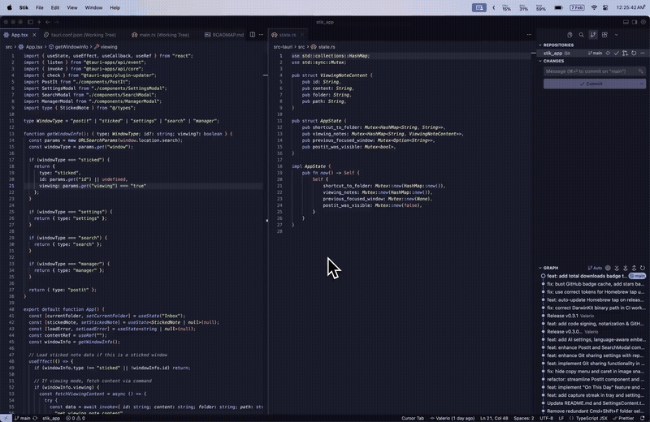

<p align="center">
  
</p>

<h1 align="center">Stik</h1>

<p align="center">
  <strong>Instant thought capture for macOS.</strong><br>
  Press a shortcut. Type your thought. Get back to work.<br>
  Under 3 seconds. Every time.
</p>

<p align="center">
  <a href="https://www.stik.ink?utm_source=github&utm_medium=readme&utm_campaign=nav_website">Website</a> &middot;
  <a href="https://www.youtube.com/watch?v=eiMUVcojTng">Demo</a> &middot;
  <a href="https://www.stik.ink/ideas?utm_source=github&utm_medium=readme&utm_campaign=nav_ideas">Ideas Board</a> &middot;
  <a href="https://x.com/stik_app">X</a> &middot;
  <a href="https://discord.gg/gG8vdCCRzW">Discord</a> &middot;
  <a href="https://www.stik.ink/download?utm_source=github&utm_medium=readme&utm_campaign=nav_download">Download</a> &middot;
  <a href="ROADMAP.md">Roadmap</a> &middot;
  <a href="CHANGELOG.md">Changelog</a>
</p>

<p align="center">
  <a href="https://github.com/0xMassi/stik_app/releases/latest"></a>
  
  
  <a href="https://github.com/0xMassi/stik_app/releases"></a>
  <a href="https://github.com/0xMassi/stik_app/stargazers"></a>
</p>

<p align="center">
  
</p>

<p align="center">
  <a href="https://www.stik.ink/download?utm_source=github&utm_medium=readme&utm_campaign=hero_cta"></a>
</p>

---

## Why Stik?

Every note app wants to be your second brain. Stik just wants to catch your thought before it disappears.

No onboarding. No account. No sync setup. Hit `Cmd+Shift+S`, type, close. Your note is saved as a plain markdown file. That's it.

## Install

### Download for Mac

Grab the latest `.dmg` from **[stik.ink/download](https://www.stik.ink/download?utm_source=github&utm_medium=readme&utm_campaign=install_primary)** — the recommended path, with release notes and a quick walkthrough.

Prefer GitHub? The same `.dmg` is on the [Releases page](https://github.com/0xMassi/stik_app/releases/latest).

### Homebrew

```bash
brew install --cask 0xMassi/stik/stik
```

Or add the tap first:

```bash
brew tap 0xMassi/stik
brew install --cask stik
```

> Requires **macOS 14+ (Sonoma)**. On first launch, grant Accessibility permissions when prompted (needed for global shortcuts).

### Update

If you installed via Homebrew:

```bash
brew upgrade --cask stik
```

From v0.3.3 onwards, Stik includes a built-in auto-updater that silently downloads new versions in the background. Updates apply on next app restart.

### Beta builds

Every push to `develop` produces a signed build, published under [Releases](https://github.com/0xMassi/stik_app/releases) as a prerelease. It installs as **Stik Beta** beside your stable copy, and Settings shows a BETA pill next to the title so you always know which one you're in.

A beta reads the same notes and settings as the stable app. Before you test anything destructive, send it somewhere harmless: Settings, Folders, Notes directory.

Stable users never see these builds. Beta releases ship no updater artifacts and leave the update feed alone.

## Features

**Capture.** A global shortcut summons a floating post-it over whatever you're doing. Type, close, done. Every note lands in `~/Documents/Stik/` as markdown.

**Voice.** `Cmd+Shift+D` transcribes speech straight into the note you're editing. `Cmd+Shift+V` opens a fresh post-it already listening. WhisperKit runs the model on the Neural Engine, so the audio never leaves your Mac.

**Clip.** `Cmd+Shift+C` takes whatever text you've selected in Safari, Terminal, VS Code, or any standard text field and appends it to a Clips note. No copy, no paste, no window switching.

**Organize.** Folders you name. Move a note with one keystroke. Search everything from the command palette.

**Pin.** Park a note on your desktop as a floating sticky.

**Rich editor.** Source-mode markdown with syntax highlighting, `==highlights==`, `[[wiki-links]]`, collapsible headings, image paste and drop, task lists, and editable tables. Type `/` for slash commands. Write your own templates in Settings. Vim mode if you want it.

**Lock.** Encrypt a note with AES-256 and open it with Touch ID or your device password. Set an idle timeout, or relock everything when the Mac sleeps.

**On-device AI.** Semantic search, folder suggestions, and note embeddings through Apple's NaturalLanguage framework. No cloud, no API keys, nothing sent anywhere.

**Language.** English and Simplified Chinese (简体中文). Press `Cmd+Shift+,` and pick one from the first card in the Appearance tab. Every open window switches without a restart. Leave it on "Follow system language" and Stik reads your macOS setting.

**Sync.** Turn on iCloud Drive in Settings and your notes reach your other Macs. Dropbox and Syncthing work too: point Stik at any folder they already watch.

**Share.** Copy a note as rich text, markdown, or an image. Push a folder to a git remote and Stik keeps it synced in the background.

**Import.** Pull notes out of Apple Notes from inside Stik. Nothing to export first.

**Themes.** System, Light, Dark, or your own colors. Follows macOS appearance as it changes.

**Remember.** A capture streak counts your daily habit. "On This Day" brings back notes from past years.

## Keyboard Shortcuts

All shortcuts are customizable in Settings.

| Shortcut | Action |
|----------|--------|
| `Cmd+Shift+S` | Capture a new note |
| `Cmd+Shift+D` | Start or stop dictation in the current note |
| `Cmd+Shift+V` | New post-it, dictating from the start |
| `Cmd+Shift+C` | Append the selected text from any app to Clips |
| `Cmd+Shift+P` | Command palette (search + folders) |
| `Cmd+Shift+M` | Command palette (alt shortcut) |
| `Cmd+Shift+L` | Reopen last note |
| `Cmd+.` | Zen mode |
| `Cmd+Shift+,` | Open settings |

## Your Data, Your Machine

- Notes are **plain markdown files** in `~/Documents/Stik/` -- open them in any editor
- All AI runs **on-device** via Apple frameworks -- nothing is sent anywhere
- No account and no cloud service. Anonymous analytics are off by default and run only after you explicitly opt in; note content, titles, folders, and paths are never collected.
- Settings stored locally in `~/.stik/`
- Want sync? Just enable iCloud Drive for your Documents folder. Stik works automatically with iCloud, Dropbox, Syncthing, or anything that syncs `~/Documents`

## Build from Source

### Prerequisites

- macOS 14+ (Sonoma)
- [Xcode Command Line Tools](https://developer.apple.com/xcode/resources/) (`xcode-select --install`)
- [Rust](https://rustup.rs/) stable
- [Node.js](https://nodejs.org/) 20+
- [Bun](https://bun.com/docs/installation) 1.4.1 (pinned in `.bun-version`)

### Build

```bash
git clone --recurse-submodules https://github.com/0xMassi/stik_app.git
cd stik_app
bun install --frozen-lockfile
./scripts/build-dev.sh dev    # Development with hot reload
./scripts/build-dev.sh build  # Local .app bundle for testing
```

## Tech Stack

| Layer | Technology |
|-------|-----------|
| Frontend | React 19, TypeScript, Tailwind CSS, CodeMirror 6 |
| Backend | Rust, Tauri 2.0 |
| AI | DarwinKit (Swift CLI wrapping Apple NaturalLanguage framework) |
| Storage | Local filesystem (`.md` files), optional git sync |

## Contributing

Contributions are welcome. Bun 1.4.1 is the canonical JavaScript package manager; keep `bun.lock` current and do not add a second lockfile. Node and Vitest remain the build-tool runtime and test runner. Please open an issue first to discuss what you'd like to change.

```bash
# Check Rust code
cd src-tauri && cargo check

# Format Rust code
cd src-tauri && cargo fmt

# Type check frontend
bun run build

# Run tests
bun run test
cd src-tauri && cargo test
```

Maintainers preparing a stable build should follow the [release checklist](docs/release-checklist.md).

**Translations.** Every string lives in [`src/i18n/locales/`](src/i18n/locales/). Copy `en.ts`, translate the values, and add your locale to `LOCALES` in `src/i18n/index.ts`. The catalogue is typed against English, so a missing key breaks the build instead of shipping a blank label, and `bun run test` checks both catalogues for drift. Corrections to [`zh-CN.ts`](src/i18n/locales/zh-CN.ts) are welcome: read it top to bottom without opening a single component.

## Ideas Board

Got a feature idea or want to vote on what gets built next? Visit the **[Stik Ideas Board](https://www.stik.ink/ideas?utm_source=github&utm_medium=readme&utm_campaign=body_ideas)** -- sign in with GitHub, submit ideas, upvote your favorites, and discuss with the community. The roadmap is shaped by you.

## Support

Have a question, found a bug, or want to request a feature? Reach out at [massimianivalerio1@gmail.com](mailto:massimianivalerio1@gmail.com), join [Discord](https://discord.gg/gG8vdCCRzW), follow us on [X](https://x.com/stik_app), or [open an issue](https://github.com/0xMassi/stik_app/issues).

## License

[MIT](LICENSE)

---

<p align="center">
  Built by <a href="https://0xmassi.dev">Massi</a><br>
  <sub>If Stik saves you time, consider leaving a star.</sub>
</p>
